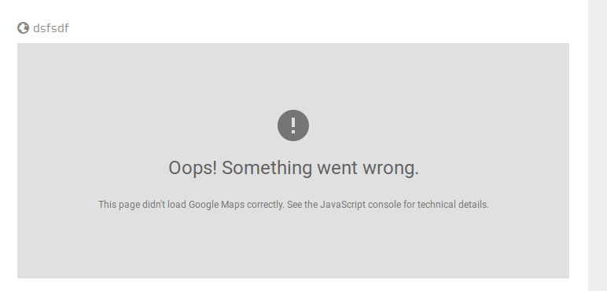

## 1. Impostare le variabili di ambiente:

Creare il file `.env`

* `ADMIN_EMAIL`: la mail dell'amministratore dell'area amministrativa
* `ADMIN_PASSWORD`: la password dell'amministratore

* `API_BASE_URL`: l'URL dell'endpoint API di Agave;
* `APP_DOMAIN`: il dominio dell'installazione di Agave;
* `DATABASE_URL`: `postgres://postgres:@db/<nome_database>`;
* `IMAGES_DOMAIN`: il dominio per le immagini e atri asset;
* `IMAGES_ENDPOINT`: l'URL dell'endpoint delle immagini;
* `JWT_SECRET`: una password complessa;
* `RAILS_ENV`: production o development;
* `READ_WRITE_ACCESS_TOKEN`: un codice esadecimale di almeno 20 cifre;
* `READ_ACCESS_TOKEN`: un codice esadecimale di almeno 20 cifre;
* `SECRET_KEY_BASE`: un codice esadecimale di almeno 20 cifre;
* `STATIC_SITE_DOMAIN`: il dominio del sito statico finale;
* `GOOGLE_MAPS_API_KEY`: la chiave di accesso per [Google Maps](
   https://developers.google.com/maps/documentation/javascript/get-api-key)
* `IUBENDA_POLICY_ID`: identificativo di Iubenda

## 2. Impostazioni DNS:

Essendo l'applicazione disponibile sul web

Per poter rendere accessibile l'applicazione via web è necessario
impostare gli indirizzi DNS che puntano: all'area amministrativa
(Agave), al sito statico e all'host che contiene le immagini.

Di norma è è sufficiente impostare il record `CNAME` contenente
l'IP o il nome del dominio che punta all'host. Ad esempio:

```
NAME             TYPE   VALUE
--------------------------------------------------
sotto-dominio-immagini  CNAME  sotto-dominio-immagini.dominio.it.
sotto-dominio-agave     CNAME  sotto-dominio-agave.dominio.it.
dominio-sito            CNAME  dominio.it.
```

Attraverso questo esempio possiamo impostare l'area di amministrazione
e il sito scolastico sullo stesso host. In questo caso, bisogna
impostare le variabili d'ambiente `STATIC_SITE_DOMAIN` e `APP_DOMAIN`
all'interno del file `.env`. Ad esempio:

```
APP_DOMAIN=sotto-dominio-agave.dominio.it
IMAGES_DOMAIN=sotto-dominio-immagini.dominio.it
STATIC_SITE_DOMAIN=dominio.it
```

## 3. Cloud

Per installare Agave è necessario avere un accesso ad un servizio
cloud che supporti i docker container (ad es.
[Microsoft Azure](https://docs.docker.com/machine/drivers/azure/),
[Digital Ocean](https://docs.docker.com/machine/drivers/digital-ocean/),
[Amazon Web Service](https://docs.docker.com/machine/drivers/aws/),
etc.).

Dopo aver creato un'istanza, è necessario:

1. Creare il file `.env`;
2. Copiare il file `docker-compose.yml`;
3. Avviare l'immagine Docker.

**N.B.**
Lo spazio dei volumi da dedicare all'applicazione dipendono dal numero
di file (immagini, documenti, etc.) che si intendono caricare.

## 4. Copia Ssh

Per copiare un file sulla macchina remota è necessario il comando `scp`.
Questo comando permette di inviare un file utilizzando una connessione
cifrata su un server remoto.

Per avviare Docker, dunque è necessario copiare il file `.env` e
`docker-compose.yml` utilizzando

`scp .env user@hostname:/path/remote/directory`
`scp .docker-compose.yml user@hostname:/path/remote/directory`

## 5. Build & Up

Per avviare l'immagine Docker bisogna entrare all'interno del cloud
server e lanciare i seguenti comandi:

```
docker-compose \
-f docker/docker-compose.yml
--project-name agave \
build

docker-compose \
-f docker/docker-compose.yml
--project-name agave \
up -d
```

Il primo esegue la fase di **build**, dove vengono generati tutti i
file necessario all'avvio dell'applicazione. Il secondo comando
lancia l'applicazione in base ai parametri forniti dal file `.env`.
L'opzione `-d` è quella di `detach` avvaindo l'applicazione in
background.

## 6. GDPR

Per poter essere in linea con le attuali leggi in materia di privacy
è necessario impostare il servizio [Iubenda](https://www.iubenda.com/it).
Una volta effettuata la registrazione bisogna modificare i seguenti file:

* `.env`: impostando la variabile `IUBENDA_POLICY_ID` con il proprio
  codice;
* `public/index.html`: impostando le variabili `cookiePolicyId` e
  `siteId` con i codici ottenuti in fase di registrazione.

## N.B.

Se la Google Maps Api Key fosse errata si otterrà il seguente messaggio:


